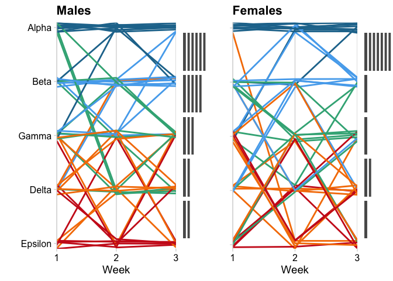
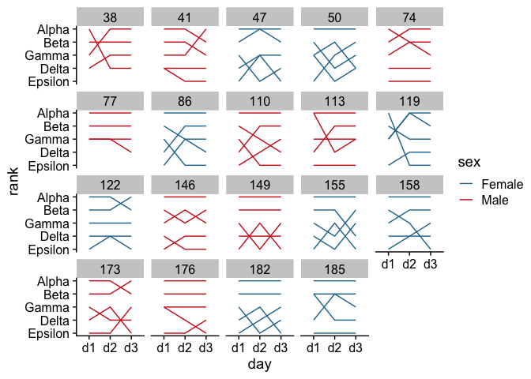
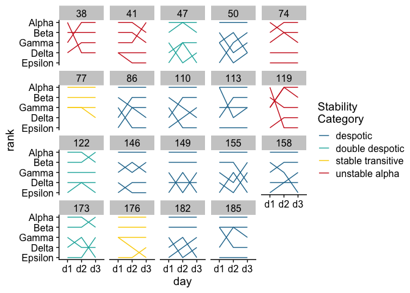
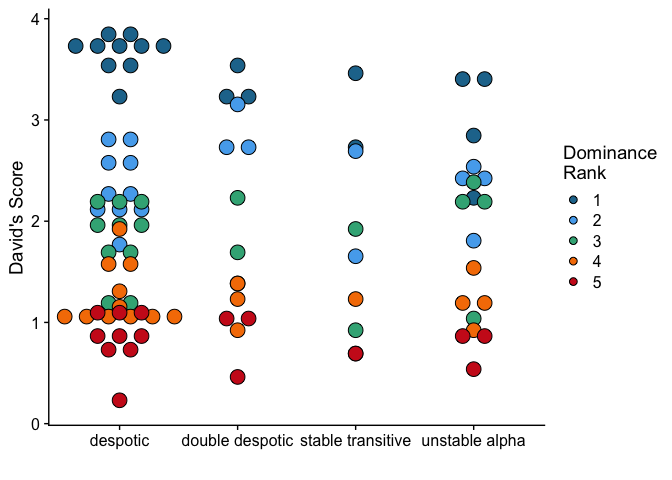
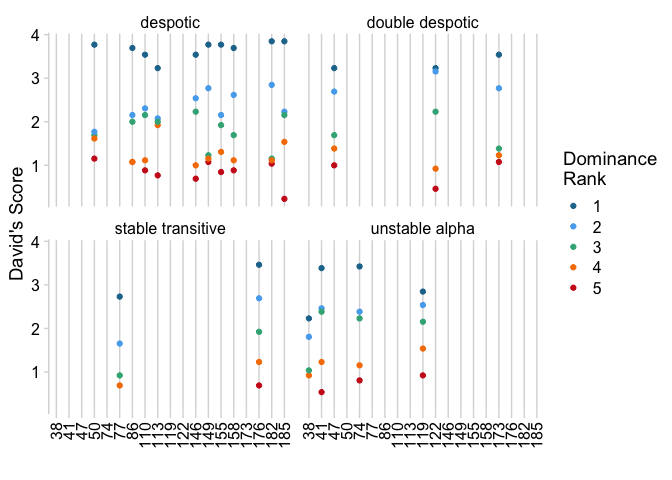

Tutorial for visualizing dominance stability data of lab mice
================
Justin Varholick
2024-01-12

## Background

After you have analyzed your dominance data (e.g., cleaned, wrangled,
and calculated the dominance metrics), you will want to visualize the
data. Here, I will first demonstrate how to visualize the stability of
dominance ranks across time, since most of my publications focused on
dominance stability. Then I will walk through some simple visualizations
for comparing the frequency of dominance behaviors. All the
visualizations are done with R using the ‘ggplot’ package. I also use
the ‘cowplot’ package for the theme and organizing the charts into
panels, and the ‘see’ package for colors.

This file can serve as a pipeline for visualizing dominance data from
your own study, just download this R markdown file and change the data.

### Load packages

``` r
library(ggplot2)
library(cowplot)
library(see)

library(dplyr)
```

    ## 
    ## Attaching package: 'dplyr'

    ## The following objects are masked from 'package:stats':
    ## 
    ##     filter, lag

    ## The following objects are masked from 'package:base':
    ## 
    ##     intersect, setdiff, setequal, union

``` r
library(tidyr)
```

### Load data

this is the same data from my \[‘tube test data analysis
tutorial’\](#this is the same data from my ‘tube test data analysis
tutorial’ & my ‘frequency and duration dominance data analysis tutorial’
(forthcoming)) & my ‘frequency and duration dominance data analysis
tutorial’ (forthcoming)

``` r
#tube test data 
ranks_per_week <- read.csv("data/ranks_per_week.csv")
ranks_per_cage <- read.csv("data/ranks_per_cage.csv")
ranks_per_cage <- ranks_per_cage %>% 
  select(animal_id, rank) %>% 
  rename(cage_rank = rank)
inventory1 <- read.csv("data/animal_inventory1.csv")
sex_id1 <- inventory1 %>% 
  select(animal_id, sex)
ranks_per_week <- left_join(ranks_per_week, sex_id1, by = "animal_id")
ranks_per_week <- left_join(ranks_per_week, ranks_per_cage, by = "animal_id")
```

### Jittered line graph with histogram

This jittered line graph nicely depicts the stability of the animals’
dominance ranks across time, and the accompanying histogram shows the
animals that remained stable throughtout (i.e., horizontal lines). This
graph appears messy by design. The general thinking in biomedical
research is that since mice are inbred (i.e., genetically identical) and
their cages are standardized (i.e., structurally identical) then all
animals should have the same behaviors — genes x environment =
phenotype. However, the social dominance hierarchies mice inevitably
form within a cage indicates that the environment is different for each
animal because they occupy a different dominance rank / social status.
Moreover, the rankings are mostly unpredictable, especially for
non-alpha ranked mice.

A similar graph was used in my publication from 2018
[10.1038/s41598-018-24624-4](https://doi.org/10.1038/s41598-018-24624-4)[-4](10.1038/s41598-018-24624-4)

``` r
#subset males and females
males <- filter(ranks_per_week, sex == "Male")
females <- filter(ranks_per_week, sex == "Female")

male_plot <- ggplot(males, aes(day, rank, group = animal_id, color = as.factor(cage_rank), label = animal_id)) +
  geom_line(linewidth = 1, aes(y=jitter(rank, .5))) +
  scale_x_discrete(labels = c("d1" = 1, "d2" = 2, "d3" = 3), expand = c(0,0)) +
  scale_y_reverse(breaks = c(1,2,3,4,5), labels = c("Alpha", "Beta", "Gamma", "Delta", "Epsilon"), expand = c(0,0)) +
  scale_color_social() + guides(colour="none") +
  ggtitle("Males") +
  xlab("Week") + ylab("") +
  theme_minimal_vgrid()

female_plot <- ggplot(females, aes(day, rank, group = animal_id, color = as.factor(cage_rank), label = animal_id)) +
  geom_line(linewidth = 1, aes(y=jitter(rank, .5))) +
  scale_x_discrete(labels = c("d1" = 1, "d2" = 2, "d3" = 3), expand = c(0,0)) +
  scale_y_reverse(breaks = c(1,2,3,4,5), labels = c("Alpha", "Beta", "Gamma", "Delta", "Epsilon"), expand = c(0,0)) +
  scale_color_social() + guides(colour="none") +
  ggtitle("Females") +
  xlab("Week") + ylab("") +
  theme_minimal_vgrid()

#make stability dataset
stability <- ranks_per_week %>% 
  select(cage_id, animal_id, sex, cage_rank, day, rank) %>% 
  pivot_wider(names_from = day, values_from = rank) %>% 
  mutate(stability = case_when(
    d1 == d2 & d2 == d3 ~ "stable",
    d1 != d2 ~ "unstable",
    d1 != d3 ~ "unstable",
    d2 != d3 ~ "unstable"
  )) %>% 
  filter(stability == "stable")

#make stability histograms of only stable animals
males <- stability %>% 
  filter(sex == "Male") 
females <- stability %>% 
  filter(sex == "Female") 

male_hist <- ggplot(males, aes(cage_rank)) +
  geom_bar() + 
  geom_hline(yintercept = 1:7,
             color = "white", linewidth = 1) +
  scale_x_reverse() + coord_flip() +
  xlab("") + ylab("")+
  theme_nothing()

female_hist <- ggplot(females, aes(cage_rank)) +
  geom_bar() + 
  geom_hline(yintercept = 1:7,
             color = "white", linewidth = 1) +
  scale_x_reverse() + coord_flip() +
  theme_nothing()
#geom_hline, removes the need for an axis, just make sure that the number of lines (e.g. 1:7) is equal to the highest number of animals for a specific rank. In this case, there were 7 female alphas that remained stable. 

#plot everything in panels
plot_grid(male_plot, male_hist, female_plot + theme(axis.text.y = element_blank()), female_hist, ncol = 4, align = "h", rel_widths = c(1.2, .2, 1, .2))
```

<!-- -->

### Panel graph of stability for each cage of animals

While the above graph informs us on the relative chaos of dominance
rankings across time, it does little to help us understand what is
occurring at a cage-level. To rectify this, we can use faceting to make
a panel for each cage of animals.

A similar graph was used in my publication from 2023
[10.3390/ani14010064](https://doi.org/10.3390/ani14010064)

``` r
ggplot(ranks_per_week, aes(day, rank, group = animal_id, color = sex)) +
  geom_line() +
  scale_y_reverse(breaks = c(1,2,3,4,5), labels = c("Alpha", "Beta", "Gamma", "Delta", "Epsilon")) + 
  scale_color_social() +
  facet_wrap(~cage_id) + theme_cowplot()
```

<!-- -->

In this case, I would manually go through each graph and begin assigning
it a stability category to better understand the general stability
between the sexes.

``` r
stability_categories <- data.frame(
  cage_id = c(38, 41, 47, 50, 74, 77, 86, 110, 113, 119, 122, 146, 149, 155, 158, 173, 176, 182, 185),
  stab_cat = c("unstable alpha", "unstable alpha", "double despotic", "despotic", "unstable alpha", "stable transitive", "despotic", "despotic", "despotic", "unstable alpha", "double despotic", "despotic", "despotic", "despotic", "despotic", "double despotic", "stable transitive", "despotic", "despotic")
)
ranks_per_week <- left_join(ranks_per_week, stability_categories, by = "cage_id")

ggplot(ranks_per_week, aes(day, rank, group = animal_id, color = stab_cat)) +
  geom_line() +
  scale_y_reverse(breaks = c(1,2,3,4,5), labels = c("Alpha", "Beta", "Gamma", "Delta", "Epsilon")) + 
  scale_color_social() +
  labs(color = "Stability \nCategory") +
  facet_wrap(~cage_id) + theme_cowplot()
```

<!-- -->

## David’s score, stability category plot

We can also use David’s score to better understand the dominance ranks
and structures. Briefly, David’s score measures the proportion of
winning. This places the rankings on a continuous scale rather than a
discrete scale, which is better for understanding animals that
frequently switch ranks.

``` r
#import data
ds_scores <- read.csv("data/ds_per_cage.csv")
ds_scores <- left_join(ds_scores, sex_id1, by = "animal_id")
ds_scores <- left_join(ds_scores, stability_categories, by = "cage_id")
ds_scores <- left_join(ds_scores, ranks_per_cage, by = "animal_id")

ggplot(ds_scores, aes(stab_cat, ds, fill = as.factor(cage_rank)))+
  geom_dotplot(binaxis = 'y', stackdir = 'center',
               stackratio=1.5, dotsize=1.2) +
  xlab("") + ylab("David's Score") +
  scale_fill_social() + labs(fill = "Dominance \nRank") + theme_cowplot()
```

    ## Bin width defaults to 1/30 of the range of the data. Pick better value with
    ## `binwidth`.

<!-- -->

We can also use facet_wrap again to better understand the data. But this
time, we will set the x-axis as the cage_id and facet_wrap on the
stability categories we set. Note, since cage_id is a number, we must
set it as.factor to make it a discrete variable rather than continuous.
We can also use a vgrid theme to keep the animals in the same cage,
visually.

``` r
ggplot(ds_scores, aes(as.factor(cage_id), ds, color = as.factor(cage_rank)))+
  geom_point() +
  xlab("") + ylab("David's Score") +
  scale_color_social() + labs(color = "Dominance \nRank") +
  facet_wrap(~stab_cat) + 
  theme_minimal_vgrid() + theme(axis.text.x = element_text(angle = 90, vjust = 0.5, hjust=1))
```

<!-- -->

### *I will try to continue adding visualizations as I think of them*
